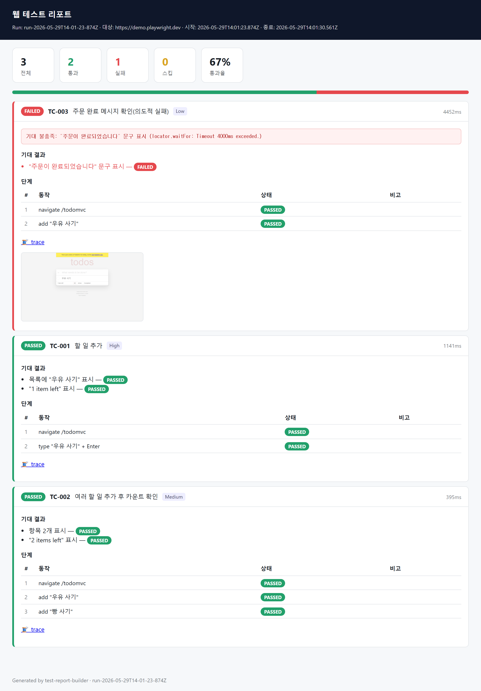
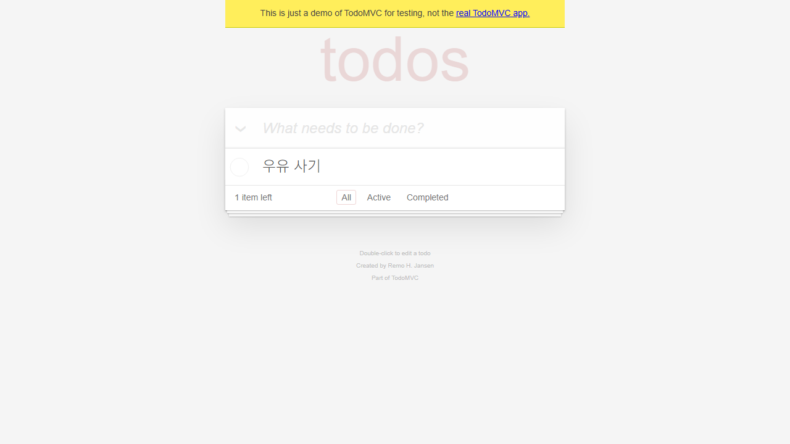

# tsg — 자연어 시나리오 기반 웹 테스트 하네스

엑셀로 작성된 **자연어 테스트 시나리오**를 받아, **라이브 웹사이트에서 직접 테스트를 수행**하고 결과를 **HTML 리포트**로 산출하는 Claude Code 하네스입니다.

```
엑셀(.xlsx) ──▶ 테스트 케이스(.md) ──▶ 브라우저 실행(Playwright MCP) ──▶ HTML 리포트
```

## 실행 예시

샘플 엑셀(TodoMVC 데모, 통과 2 / 실패 1)로 전 파이프라인을 실행했을 때 생성되는 HTML 리포트입니다.



- 상단에 통과/실패/스킵 통계와 통과율을 표시
- **실패 케이스를 맨 위에 배치**하고 에러 메시지·실패 시점 스크린샷을 함께 첨부
- 케이스별 단계 테이블과 기대 결과 검증 상태, 트레이스 링크 제공

실패 케이스는 실패 시점의 브라우저 화면을 자동 캡처합니다:



## 동작 방식

3개의 전문 에이전트가 **서브 에이전트 파이프라인**으로 순차 협업합니다. (Playwright MCP 브라우저는 동시에 여러 에이전트가 제어할 수 없는 단일 상태 리소스이므로 팀 모드 대신 순차 파이프라인을 사용합니다.)

| 단계 | 에이전트 | 스킬 | 입력 → 출력 |
|------|---------|------|------------|
| 1 | `test-case-builder` | `excel-to-testcase` | 엑셀 → `_workspace/01_testcases/*.md` |
| 2 | `test-executor` | `browser-test-execution` | 케이스 → `results.json` + 스크린샷/비디오/트레이스 |
| 3 | `test-reporter` | `test-report-builder` | 결과 → `report/index.html` + `report/summary.md` |

전 과정은 오케스트레이터 스킬 **`web-test-orchestrator`** 가 조율합니다.

## 디렉토리 구조

```
.claude/
├── agents/                      # 에이전트 정의 (누가)
│   ├── test-case-builder.md
│   ├── test-executor.md
│   └── test-reporter.md
└── skills/                      # 스킬 (어떻게)
    ├── web-test-orchestrator/   # 오케스트레이터
    ├── excel-to-testcase/       # 엑셀→케이스 변환 (+ scripts/xlsx-to-md.mjs)
    ├── browser-test-execution/  # Playwright MCP 실행
    └── test-report-builder/     # 리포트 생성 (+ scripts/build-report.mjs)
.mcp.json                        # Playwright MCP 서버 설정
.env.example                     # 자격증명 템플릿 (복사해서 .env 작성)
CLAUDE.md                        # 하네스 포인터 + 변경 이력
```

> 실행 산출물(`_workspace/`, `report/`), `.env`, `node_modules/`는 `.gitignore`로 제외됩니다.

## 사전 준비

1. **의존성 설치**
   ```bash
   npm install                    # xlsx, playwright
   npx playwright install chromium
   ```

2. **자격증명 설정** — `.env.example`을 `.env`로 복사 후 값 입력 (채팅에 평문 입력 금지)
   ```ini
   TEST_BASE_URL=https://your-site.com
   TEST_USERNAME=...
   TEST_PASSWORD=...
   ```

3. **Playwright MCP 연결** — `.mcp.json`에 `playwright` 서버가 등록돼 있습니다. Claude Code 세션을 다시 시작하면 자동 연결됩니다.

## 사용법

Claude Code 세션에서 자연어로 요청하면 오케스트레이터가 트리거됩니다:

```
이 엑셀 시나리오로 사이트 테스트 해줘: ./scenarios.xlsx
```

후속 작업도 같은 스킬이 처리합니다:
- "실패한 케이스만 다시 실행해줘"
- "리포트만 다시 생성해줘"
- "시나리오를 업데이트하고 재실행"

### 엑셀 시나리오 형식

헤더는 한국어/영어를 자동 매핑합니다 (느슨한 부분일치):

| 표준 필드 | 인식되는 헤더 예시 |
|----------|------------------|
| id | TC, 번호, No |
| title | 시나리오, 테스트명, 케이스명 |
| priority | 우선순위, 중요도 |
| precondition | 사전조건, 전제조건 |
| steps | 단계, 수행절차, 테스트절차 |
| expected | 기대결과, 예상결과 |
| url | URL, 대상, 경로 |

`steps`/`expected` 셀은 줄바꿈으로 여러 항목을 구분합니다. 자격증명은 `{{TEST_USERNAME}}` 같은 플레이스홀더로 작성하면 실행 시 `.env` 값으로 치환됩니다.

### 스크립트 직접 실행 (선택)

에이전트 없이 결정적 단계만 수동 실행할 수도 있습니다:

```bash
# 엑셀 → 테스트 케이스 마크다운
node .claude/skills/excel-to-testcase/scripts/xlsx-to-md.mjs scenarios.xlsx --out _workspace/01_testcases

# results.json → HTML 리포트
node .claude/skills/test-report-builder/scripts/build-report.mjs _workspace/02_results/results.json --out report
```

## 리포트

`report/index.html` — 통과/실패/스킵 통계, 케이스·단계별 상세, 실패 케이스 상단 배치, 스크린샷·비디오·트레이스 링크 포함.
`report/summary.md` — 핵심 지표 + 실패 원인 분석 + 권장 조치.

## 검증 상태

샘플 엑셀(TodoMVC 데모, 통과 2 / 실패 1)로 전 파이프라인을 완주 검증했습니다. 자세한 이력은 `CLAUDE.md` 변경 이력 참조.
